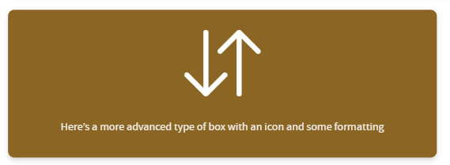

This is a small filter to allow you to set up value boxes in any Quarto document.


There are a wide range of customisation options available for size, icon type, and

## Installation

You can add this extension to your project by running

```
quarto add bergam0t/quarto_value_box
```

## Usage

First, you must make sure the filter is added to the list of extensions in your document header.

> [!WARNING]
> Note that it is called 'value-box' when added to your document - not 'quarto_-_value_box'


```yml
---
format:
  revealjs: default  # this will also work with other web-based formats, such as html
filters:
  - value-box
---
```

> [!TIP]
> You could also do
>
> ```yml
> ---
> filters:
>   - bergam0t/value-box
> ---
> ```
>
> if you have another filter extension with the same name!


Now you can create value boxes like so:

```md
::: {.value-box value=60}
Number of bibbles bobbled this week
:::
```


```md
::: {.value-box icon="bi-arrow-down-up" color="bg-amber" width="60%" align="center"}
Here's a more advanced type of box with an icon and some formatting, but no value
:::
```



## Customisation

| Parameter | Type | Default | Description |
|---|---|---|---|
| `value` | string | `""` | A prominent value or stat displayed above the main content. |
| `icon` | string | `""` | Icon identifier or file path. For Bootstrap Icons use e.g. `bi-star`, for Font Awesome `fa-star`, for image types provide a file path e.g. `images/icon.svg`. Supported options are font awesome, bootstrap icons, svg, and png. If font awesome or bootstrap icons are used, the required stylesheet will automatically be linked to in your document header. |
| `icon-type` | `bi` \| `fa` \| `svg` \| `png` | auto | Icon library or format to use. If omitted the type is auto-detected from the `icon` value, falling back to Bootstrap Icons. |
| `icon-size` | string | `8em` / `256px` | Size of the icon. Font-based icons (`bi`, `fa`) default to `2em`; image-based (`svg`, `png`) default to `128px`. Accepts any valid CSS size unit. |
| `icon-position` | `top` \| `bottom` \| `left` \| `right` | `top` | Where the icon is rendered relative to the box content. |
| `color` | string | `bg-blue` | CSS class or value controlling the box background colour. Prespecified options are bg-blue, bg-navy, bg-teal, bg-green, bg-olive, bg-amber, bg-orange, bg-red, bg-pink, bg-purple, bg-slate, bg-grey. For details on how to change or add colours, see the advanced customisation section below. |
| `width` | string | `80%` | Width of the box. Accepts any valid CSS size unit e.g. `50%`, `300px`. |
| `height` | string | `""` | Height of the box. If omitted the box sizes to its content. Accepts any valid CSS size unit e.g. `200px`. |
| `align` | `left` \| `center` \| `right` | `left` | Horizontal text alignment within the box. |
| `href` | string | `""` | If provided, wraps the entire box in a link. |
| `fragment` | string \| `true` | — | Enables Reveal.js fragment animation. Set to `true` for the default `fade-in-then-semi-out` animation, or provide any valid Reveal.js fragment class (see https://quarto.org/docs/presentations/revealjs/advanced.html#fragment-classes). |
| `index` | string | — | Sets the `data-fragment-index` for controlling Reveal.js fragment ordering. |

## Advanced Customisation

### Colours

A range of colours are supported.

To override in your project, add your own SCSS file and include it after the extension in your _quarto.yml. Quarto loads styles in order, so yours will win:

```yml
format:
  revealjs:
    css: my-colours.scss
```

(swapping revealjs for whatever format you are using, like html)

Your overrides and new colours should be specified like this.

background-color specifies the colour of the box.
color is used for text and icons within the box.

```scss
// Override extension defaults
.bg-blue  { background-color: #1a3f6f; color: white; }

// Add entirely new colours not in the extension
.bg-brand { background-color: #c8102e; color: white; }
```

You can also use SCSS variables if you want to define your palette once and reuse it across your project:
```scss
// my-colours.scss
$brand-primary:   #c8102e;
$brand-secondary: #003087;
$brand-neutral:   #4a4f57;

.bg-brand-primary   { background-color: $brand-primary;   color: white; }
.bg-brand-secondary { background-color: $brand-secondary; color: white; }
.bg-brand-neutral   { background-color: $brand-neutral;   color: white; }
```

### Contributing

Please take a look at our [contributor guidance](CONTRIBUTING) and [code of conduct](CODE_OF_CONDUCT)


### Generative AI use disclosure and policy

This filter has been written with the help of Claude Sonnet 4.6 and Gemini 3.1 Pro.

All AI-generated code has been thoroughly reviewed and tested before inclusion.

We are happy to accept AI-supported contributions to the extension, but reserve the right to reject wholly AI generated pull requests which are not felt to add value to the project.
