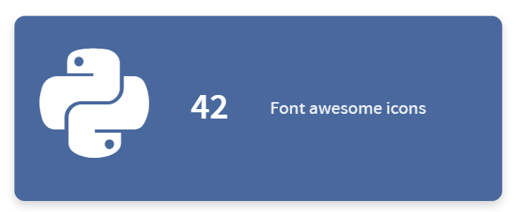
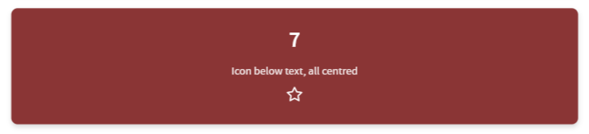
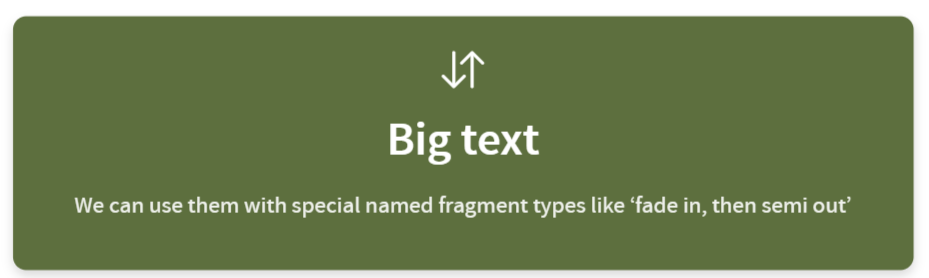
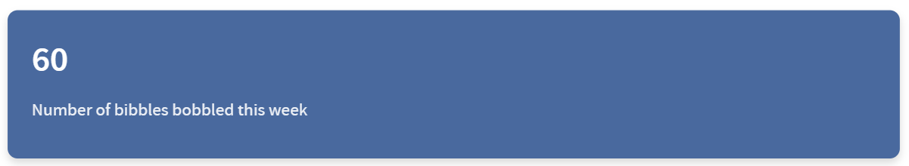
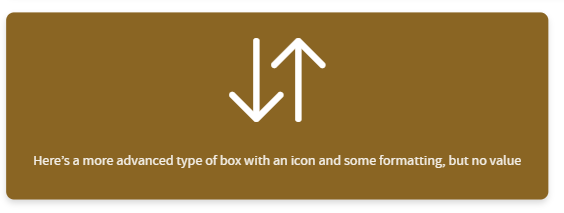

This is a small filter to allow you to set up value boxes in any Quarto document.







There are a wide range of customisation options available for size, icon type, and more (see the full list in the [customisation](https://github.com/Bergam0t/quarto_value_box#customisation) section below.)

## Installation

You can add this extension to your project by running

```
quarto add bergam0t/quarto-value-box
```

## Usage

First, you must make sure the filter is added to the list of extensions in your document header.

```yml
---
format:
  revealjs: default  # this will also work with other web-based formats, such as html
filters:
  - value-box
---
```

> [!WARNING]
> Note that it is called 'value-box' when added to your document - not 'quarto-value-box'


> [!TIP]
> You could also do
>
> ```yml
> ---
> filters:
>   - bergam0t/value-box
> ---
> ```
>
> if you have another filter extension with the same name!


Now you can create value boxes like so:

```md
::: {.value-box value=60}
Number of bibbles bobbled this week
:::
```



```md
::: {.value-box icon="bi-arrow-down-up" color="bg-amber" width="60%" align="center"}
Here's a more advanced type of box with an icon and some formatting, but no value
:::
```



## [Customisation](#customisation)

| Parameter             | Type                                | Default         | Description                                                                                                                                                                                                                                                                                                                                                                                       |
| --------------------- | ----------------------------------- | --------------- | ------------------------------------------------------------------------------------------------------------------------------------------------------------------------------------------------------------------------------------------------------------------------------------------------------------------------------------------------------------------------------------------------- |
| `value`               | string                              | `""`            | A prominent value or stat displayed above the main content.                                                                                                                                                                                                                                                                                                                                       |
| `icon`                | string                              | `""`            | Icon identifier or file path. For Bootstrap Icons use e.g. `bi-star`, for Font Awesome `fa-star`, for Material Symbols use the icon name directly e.g. `home` (requires `icon-type="material"`), for image types provide a file path e.g. `images/icon.svg`. Supported options are Font Awesome, Bootstrap Icons, Material Symbols, SVG and PNG. If Font Awesome, Bootstrap Icons, or Material Symbols are used, the required stylesheet will automatically be linked in the document header. |
| `icon-type`           | `bi` \| `fa` \| `svg` \| `png` \| `material` \| `material-outlined` \| `material-rounded` \| `material-sharp` | auto | Icon library or format to use. If omitted the type is auto-detected from the `icon` value, falling back to Bootstrap Icons. Material Symbols is never auto-detected — it must always be set explicitly, since a bare icon name like `home` is indistinguishable from a Bootstrap Icons fallback string. |
| `icon-size`           | string                              | `3em` / `128px` | Size of the icon. Font-based icons (`bi`, `fa`, `material*`) default to `3em`; image-based (`svg`, `png`) default to `128px`. Accepts any valid CSS size unit.                                                                                                                                                                                                                                    |
| `icon-position`       | `top` | `bottom` | `left` | `right` | `top`           | Where the icon is rendered relative to the box's content (the value and details together). Independent of `value-position`.                                                                                                                                                                                                                                                                      |
| `value-position`      | `top` | `bottom` | `left` | `right` | `top`           | Where the value is rendered relative to the details text. Independent of `icon-position`.                                                                                                                                                                                                                                                                                                        |
| `icon-color`          | string                              | `white`         | Colour of Font Awesome, Bootstrap Icons, or Material Symbols. Ignored for image-based icons (`svg`, `png`). Accepts any valid CSS colour value.                                                                                                                                                                                                                                                   |
| `color`               | string                              | `bg-blue`       | CSS class or value controlling the box background colour. Prespecified options are `bg-blue`, `bg-navy`, `bg-teal`, `bg-green`, `bg-olive`, `bg-amber`, `bg-orange`, `bg-red`, `bg-pink`, `bg-purple`, `bg-slate`, `bg-grey`. For details on changing or adding colours, see the [advanced customisation](https://github.com/Bergam0t/quarto_value_box?tab=readme-ov-file#colours) section below. |
| `width`               | string                              | `80%`           | Width of the box. Accepts any valid CSS size unit, e.g. `50%`, `300px`.                                                                                                                                                                                                                                                                                                                           |
| `height`              | string                              | `""`            | Height of the box. If omitted the box sizes to its content. Accepts any valid CSS size unit, e.g. `200px`.                                                                                                                                                                                                                                                                                        |
| `font-size`           | string                              | browser default | Font size used for the main content of the value box (excluding the `value`). Accepts any valid CSS size unit.                                                                                                                                                                                                                                                                                    |
| `value-font-size`     | string                              | `2.2rem`        | Font size used for the `value` displayed above the main content. Accepts any valid CSS size unit.                                                                                                                                                                                                                                                                                                 |
| `font-color`          | string                              | `white`         | Text colour used for the main content. Accepts any valid CSS colour value.                                                                                                                                                                                                                                                                                                                        |
| `value-color`         | string                              | `font-color`    | Text colour used for the `value`. Defaults to the same colour as `font-color`. Accepts any valid CSS colour value.                                                                                                                                                                                                                                                                                |
| `align`               | `left` \| `center` \| `right`         | `left`          | Horizontal text alignment within the box.                                                                                                                                                                                                                                                                                                                                                         |
| `valign`              | `top` \| `middle` \| `bottom`         | `middle`        | Vertical alignment within the box. Accepts one of the example strings for convenience, but any valid CSS `justify-content` or `align-items` value is also accepted.                                                                                                                                                                                                                               |
| `outer-extra-style`   | string                              | `""`            | Additional CSS styles applied to the outer value box container. Useful for advanced customisation beyond the built-in options.                                                                                                                                                                                                                                                                    |
| `content-extra-style` | string                              | `""`            | Additional CSS styles applied to the wrapper around the value and details (the element positioned by `value-position`). Useful for advanced customisation beyond the built-in options.                                                                                                                                                                                                           |
| `details-extra-style` | string                              | `""`            | Additional CSS styles applied to the wrapper around the main content. Useful for advanced customisation beyond the built-in options.                                                                                                                                                                                                                                                              |
| `value-extra-style`   | string                              | `""`            | Additional CSS styles applied to the `value` element. Useful for advanced customisation beyond the built-in options.                                                                                                                                                                                                                                                                              |
| `icon-extra-style`    | string                              | `""`            | Additional CSS styles applied to the icon element. Useful for advanced customisation beyond the built-in options.                                                                                                                                                                                                                                                                                 |
| `href`                | string                              | `""`            | If provided, wraps the entire box in a link.                                                                                                                                                                                                                                                                                                                                                      |
| `fragment`            | string | `true`                     | Enables Reveal.js fragment animation. Set to `true` for the default `fade-in-then-semi-out` animation, or provide any valid Reveal.js fragment class (see [https://quarto.org/docs/presentations/revealjs/advanced.html#fragment-classes](https://quarto.org/docs/presentations/revealjs/advanced.html#fragment-classes)). If providing one of the Reveal.js fragment classes, format this argument like `fragment=".fade-in"`.                                                                        |
| `index`               | string                              | `""`              | Sets the `data-fragment-index` for controlling Reveal.js fragment ordering. Ensure to pass as a string (e.g. "1", "2").                                                                                                                                                                                                                                                                                                                       |


## Advanced Customisation

### Colours

A range of colours are supported.

To override in your project, add your own SCSS file and include it after the extension in your _quarto.yml. Quarto loads styles in order, so yours will win:

```yml
format:
  revealjs:
    css: my-colours.scss
```

(swapping revealjs for whatever format you are using, like html)

Your overrides and new colours should be specified like this.

background-color specifies the colour of the box.
color is used for text and icons within the box.

```scss
// Override extension defaults
.bg-blue  { background-color: #1a3f6f; color: white; }

// Add entirely new colours not in the extension
.bg-brand { background-color: #c8102e; color: white; }
```

You can also use SCSS variables if you want to define your palette once and reuse it across your project:
```scss
// my-colours.scss
$brand-primary:   #c8102e;
$brand-secondary: #003087;
$brand-neutral:   #4a4f57;

.bg-brand-primary   { background-color: $brand-primary;   color: white; }
.bg-brand-secondary { background-color: $brand-secondary; color: white; }
.bg-brand-neutral   { background-color: $brand-neutral;   color: white; }
```

### Contributing

Please take a look at our [contributor guidance](CONTRIBUTING) and [code of conduct](CODE_OF_CONDUCT)


### Generative AI use disclosure and policy

This filter has been written with the help of Claude Sonnet 4.6, Claude Sonnet 5.0, Claude Opus 5.0, and Gemini 3.1 Pro.

All AI-generated code has been thoroughly reviewed and tested before inclusion.

We are happy to accept AI-supported contributions to the extension, but reserve the right to reject wholly AI generated pull requests which are not felt to add value to the project.
